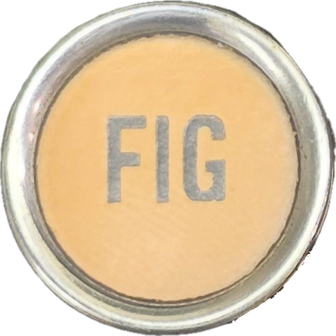

  

<h1 align="center">FigureShift</h1>

<em>Get your typewriter collection onto the Typewriter Database — without the busywork.</em>

---

If you have a backlog of typewriters to add to the [Typewriter Database](https://typewriterdatabase.com)
(TWDB), you know the routine: resize every photo, fill out the same form again, repeat a hundred times.
**FigureShift does the tedious parts for you.**

Point it at a folder of your typewriter photos and it:

- 📂 **Finds each machine for you** — one folder per typewriter; it reads the folder's name to pre-fill the make, model, and year.
- 🖼️ **Handles the photos** — auto-resizes for TWDB, lets you choose the cover, type sample, and gallery shots, and includes a built-in **crop & rotate** editor.
- ⬆️ **Uploads in bulk** — push one machine, or your whole backlog at once, with live progress.
- 💾 **Picks up where you left off** — your work is saved on disk, so you can stop and come back any time.
- 🔒 **Keeps your login private** — your TWDB password is stored only on your computer, in the system credential store (Keychain on macOS, Credential Manager on Windows). It never leaves your machine except to sign in to TWDB.

Built for collectors with big backlogs — nothing technical required.

## Download

Grab the latest build from the [**Releases page**](https://github.com/jberger/FigureShift/releases) —
macOS (Apple Silicon or Intel) and Windows.

These are early **beta** builds, and they're **unsigned**, so on first launch:

- **macOS** — it's unsigned, so macOS blocks it the first time. Open **System Settings → Privacy & Security** and click **Open Anyway**, or run `xattr -dr com.apple.quarantine /path/to/FigureShift.app`.
- **Windows** — if SmartScreen warns, click **More info → Run anyway**.

(Each release lists the exact steps.)

## How it works

1. **Sign in** with your TWDB account.
2. **Organize** — put each typewriter's photos in its own folder, named like *"Smith-Corona Silent 1948."*
3. **Pick the folder** that holds them all — FigureShift scans it and fills in what it can.
4. **Review** each machine, set the photo roles, and **push** to TWDB.

A short walkthrough guides you the first time you open the app, and is always available under **"How it works."**

## For developers

FigureShift is an Electron + React desktop app, and the second consumer of the
[`@joelberger/twdb-client`](https://github.com/jberger) library. Build, test, and packaging notes are in
[docs/BUILDING.md](docs/BUILDING.md).

## License

[MIT](LICENSE) © Joel Berger
